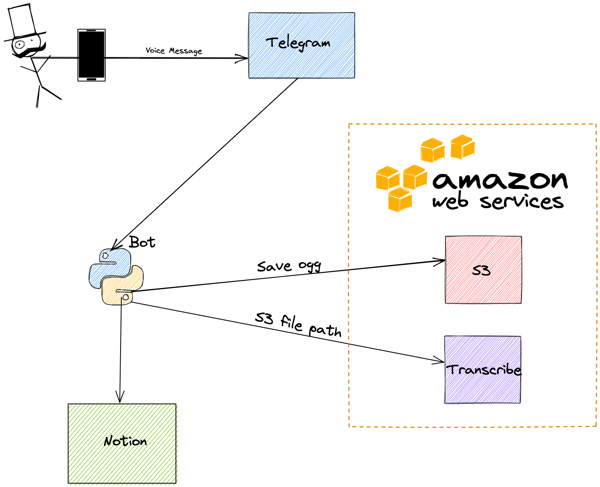

# hyena

Hyena is a telegram bot that helps to digest visual and vocal input into Notion's GTD inbox.

## Environment Variables

Some env vars should be set in order for the bot to function:

- `TELEGRAM_BOT_TOKEN`: The Hyena bot token
- `NOTION_API_TOKEN`: The Notion token of the Hyena integration
- `NOTION_DATABASE_ID`: The ID of the inbox database in notion
- `AWS_ACCESS_KEY_ID`: required in order to access AWS Transcribe (and S3)
- `AWS_SECRET_ACCESS_KEY`: required in order to access AWS Transcribe (and S3)
- `AWS_DEFAULT_REGION`: The default AWS region
- `AWS_BUCKET_NAME`: The bucket to save the voice files to before transcribing

## Voice Messages Flow

